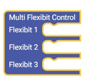
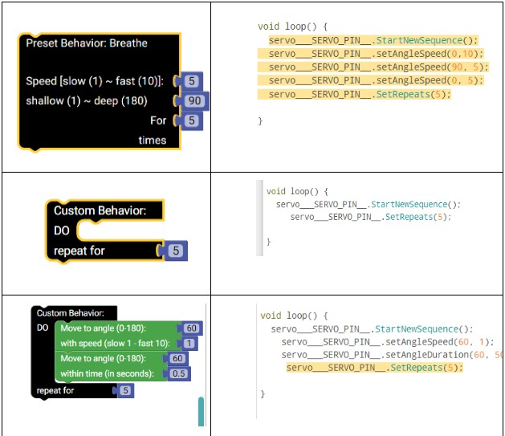

# Table of Contents
1. [Intro](#Intro)
2. [How to run the program](#How-to-run-the-program)
3. [How to add new Categories and Blocks](#how-to-add-new-categories-and-blocks)
4. [How to deploy to render](#how-to-deploy-to-render)
5. [Arduino APIs](#arduino-apis)
6. [Tooltip, input restriction, user instruction and block chaining policy](#tooltip-input-restriction-user-instruction-and-block-chaining-policy)
7. [Credit](#credit)
8. [License](#license) 


## Intro
TODO


## How to run the program 
2 ways:
1. Rendered link: [https://flexibitworkshoptool-28j3.onrender.com/](https://flexibitworkshoptool-28j3.onrender.com/) 
2. If want to run on local machine ( for tests during development)
    1) Clone from with following command
       ```bash
           git clone https://github.com/xinyue-ash/FlexibitWorkshopTool.git
           cd ardublockly
           git submodule update --init --recursive
       ```
  
    -  (the last command will run for a while, please](image.png) allow enough time for it to finish, so that the submodule will be download in “closure-libaray” folder) 
    2) Run `python ./start.py`. And go to [http://127.0.0.1:5000/](http://127.0.0.1:5000/) in your browser


## How to add new Categories and Blocks: 


Creating a new custom block usually involves following steps:


1. **Folder Setup for Categories**
- If a new Category is needed: 
    1) Create a Category Folder	Navigate to `\build\blocks\` and create a folder named after your desired category. This category name will appear in the menu (e.g., “Customization” or “Preset Behaviors”).

    2) In `\build\blocks\<category>`, include the following files:
       * `blocks.js` – Defines the blocks.
       * `generator_arduino.js` – Generates Arduino code for the blocks.
       * `blocks_config.json` – Stores block configurations.


2. **Block Defination:** 
- Define block's appearance on interface (text, input, color, aligment, tooltip, warning message)

      Go to `\build\blocks\<category>\blocks.js`
    * Reference the Google Blockly tutorials on block definition for guidance.
      * [https://developers.google.com/blockly/guides/create-custom-blocks/define-blocks](https://developers.google.com/blockly/guides/create-custom-blocks/define-blocks) 
    * For help creating blocks visually, use the Blockly Block Factory.
      * [https://technologiescollege.github.io/Blockly-at-rduino/tools/factory/block_factory.html?lang=](https://technologiescollege.github.io/Blockly-at-rduino/tools/factory/block_factory.html?lang=) 
    * Changing color:
      * [https://developers.google.com/blockly/guides/create-custom-blocks/block-colour?_gl=1*jezlx1*_up*MQ..*_ga*MTE3NjI3MTcxNC4xNzI2](https://developers.google.com/blockly/guides/create-custom-blocks/block-colour?_gl=1*jezlx1*_up*MQ..*_ga*MTE3NjI3MTcxNC4xNzI2MDM0MTQz*_ga_R5G2Y6GLVC*MTcyNjAzNDE0Mi4xLjEuMTcyNjAzNDE0Mi4wLjAuMA) 
    
    
    * Changing texts on the block
      * need to change parameters in `.appendField()`
      <br />
    
- Example: Add a custom “Shake” block under `Preset Behavior` to your Arduino Blockly environment. The “Shake” block allows users to specify a number of shake cycles.

    - The block is defined using the Blockly.Blocks object in `\build\blocks\Preset Behavior\blocks.js`. Below is the complete code for the “Shake” block: 
    ``` C++
        Blockly.Blocks["shake"] = {
          init: function () {
            this.appendDummyInput().appendField("Preset Behavior: Shake"); // Adds a label to the block.
            this.appendValueInput("CYCLES")
              .appendField("For")
              .setCheck(Blockly.Types.NUMBER.checkList)
              .setAlign(Blockly.ALIGN_RIGHT); //Adds an input field for the number of cycles, ensuring it accepts only numbers. The input block alight to the right. 
            this.appendDummyInput().appendField("times"). setAlign(Blockly.ALIGN_RIGHT); //Adds a label for the unit of cycles.
            this.setPreviousStatement(true, "Behavior");
            this.setNextStatement(true, "Behavior"); //Allows the block to be connected to Behavior blocks before and after it.
            this.setTooltip("Shake for a specified number of times."); // Sets a tooltip for the block.
          },
          //Checks if the block is still in the workspace.
          // Validates the input for the number of cycles. 
          // If the input is less than 1 or not a number, it displays a warning and disables the block.
          onchange: function (event) {
            if (!this.workspace) {
              return;
            }
            const shakeBlock = this.getInputTargetBlock("CYCLES");
            if (shakeBlock && shakeBlock.type === "math_number") {
              const numCycles = parseFloat(shakeBlock.getFieldValue("NUM"));
              if (numCycles < 1 || isNaN(numCycles)) {
                this.setWarningText("Number of times must be greater than 0.");
                this.setDisabled(true);
              } else {
                this.setWarningText(null);
                this.setDisabled(false);
              }
            }
          },
        };
    ```
    
3. **Code Generator:**
- This defines the Arduino code to generate after the block is placed in the playground 
- To generate Arduino code for your block:
  Go to `\build\blocks\<category>\generator_arduino.js`. You can store [Arduino APIs Code](#arduino-apis) for this interface as variable and return  code.
<br />
- Example: continue the example of "Shake" block 
    
  ``` C++
    Blockly.Arduino["shake"] = function (block) {
      var cycles = Blockly.Arduino.valueToCode(block, "CYCLES", Blockly.Arduino.ORDER_ATOMIC) || "5";  //retrieves the value from the “CYCLES” input. If no value is provided, it defaults to “5”.
      var code =
        'servo___SERVO_PIN__.StartNewSequence();\n' +
        'servo___SERVO_PIN__.setAngleSpeed(80,10);\n' +
        'servo___SERVO_PIN__.setAngleSpeed(100,10);\n' +
        'servo___SERVO_PIN__.SetRepeats(' + cycles + ');\n';
      return code; //Construct Code String: The code variable is constructed by concatenating strings that represent the Arduino commands. 
    };        
  ```
   
4. **Toolbox XML Defination:**

- Toolbox determines location (under which Category) or display of the block on the interface 

- To add your blocks to the toolbox, update the following files with the necessary XML configurations:
      * `\build\blocks\<category>\blocks_config.json`
      * `\build\blocks\blocks_data.json`
      * `\build\ardublockly_toolbox.js`
      
        > 💡 **If a block definition already exists in another category**
        > - let say if in category C2 I want to add a block "jump", but "jump" block ready have defination in category C1 (aka, has defined in all files `\build\blocks\C1\`)
        > - Then, you only need to add XML defination of "jump" in `\build\ardublockly_toolbox.js` under category `C2` element tag , there is **no need** to add XML defination in `\build\blocks\<category>\blocks_config.json` and  `\build\blocks\blocks_data.json`
   
        
        > 💡 **If you want to change a Category name:**  
        > - you need to change the directory name `\build\blocks\<new_category_name>`
        > - In `\build\blocks\<new_category_name>\block_config.json` and `\build\blocks\blocks_data.json` , need to change `categoryName`, `toolboxName` field, and the `id` and `name` attributes in the `<category>` tag in "toolbox" field to be the new category name.
        > - In `\build\ardublockly_toolbox.js`, change the the `id` and `name` attributes in the `<category>` tag of this category

- Example (the 'Shake' block)

- In `\build\blocks\Preset \blocks_config.json` and In `\build\blocks\blocks_data.json`

    ``` JSON
        {
          // category defination, don't have to redeclare if existed 
        "categoryName": "Preset Behaviors",
        "description": "Behavior blocks for Flexibit connect to pin9",
        "languages": [
            "en"
        ],
        "toolboxName": "Preset Behaviors",
        "toolbox": [
          "<category id=\"Preset Behaviors\" name=\"Preset Behaviors\">", // the block should under category tag
          // add your xml defination here 
          "<block type=\"shake\">", // Defines a block of type “shake”
          "       <value name=\"CYCLES\">", //Specifies an input named “CYCLES” for the “shake” block.
          "             <block type=\"math_number\">", //Defines a nested block of type “math_number”.
          "               <field name=\"NUM\">5</field> ", //Sets the default value of the “math_number” block to 5.
          "            </block>",
          "       </value>",
          "</block>",
          // " other blocks "
          "</category>"  
    ```


- In `\build\blocks\blocks_data.json`
    ```Javascript
      Ardublockly.TOOLBOX_XML =
      '<xml>'
      '<category id="Preset Behaviors" name="Preset Behaviors">' +
      // add your "shake" XML defination here in STRING format
      '   <block type="shake">' +
      '      <value name="CYCLES">' +
      '        <block type="math_number">' +
      '          <field name="NUM">5</field>' +
      '        </block>' +
      '      </value>' +
      '   </block > ' +
      '</category> ' + 
      `</xml>' 
    ```
      
5. **Test Changes:**
    Run `python ./start.py`. And go to [http://127.0.0.1:5000/](http://127.0.0.1:5000/) in your browser.
    For your changes to take effect, perform a hard refresh:
    * Open the browser console with `F12`.
    * Right-click the refresh button.
    * Select "Empty Cache and Hard Reload."


## How to deploy to render
* there are two branches that are up-to-date and very important
    * `flask`: the deloyment branch, everything pushed into this branch will automatically deloyed to Render server.
    * `master` : has all the up-to-data code, serve as a back-up branch for flask (deployment branch)
 
      
## Arduino APIs 

Sample Arduino Sketch is in **\Hardware\MultiControWithDelay.ino** (not used in interface, just for reference )


### Data Structure ###
  *  A `Target` struct stores the configuration a the atomic behavior. There are two kinds of configuration
      * Angle, duration when useSpeed = false
      * Angle, speed when useSpeed = true
        
  * A `Sequence` is a sequence of one or more atomic behavior that defined by corresponding `Target` struct
    
  * `ServoController` Class
    *  Manages behavior and states for each servo. Initialized with arrays of `Target`, `Sequence`, and `Servo` instances and other state variables
         * **Main Methods:**
            * `Attach()`
            * `Update()`
            * `StartNewSequence()`
            * `SetRepeats()`
            * `ResetSequence()`
            * `setAngleDuration()`
            * `setAngleSpeed()`
            * `addDelayDuration()`
        * **Private Helper:**
            * `addTargetToSequence()`
              
        > :bulb: **Tip:** One ServoController is initialized for _EACH servo._

        
### Wrapper Block (Purple Block) ###



  * This block initializes Target, Sequence, ServoControllers, and Arduino’s setup() and loop() methods. It also instantiates three ServoControllers:

    * Flexibit 1: servo_9 (pin 9)
    * Flexibit 2: servo_10 (pin 10)
    * Flexibit 3: servo_11 (pin 11)

  * The conversion logic for this block is in: `\build\blocks\Customization\generator_arduino.js`
      * (under `Blockly.Arduino['multi_servo_control']` )
  * Note: The block replaces `__SERVO_PIN__` with the actual pin number when a behavior block is placed in a Flexibit slot.

### **Atomic Behaviors**

These helper functions can be encapsulate in servo behavior blocks in `generator_arduino.js` :

1. `.setAngleDuration(int angle, int duration)
`Move the servo to a specified angle over a duration (ms).
2. `.setAngleSpeed(int angle, int speed)
`Move the servo to a specified angle at a speed (1 = slow, 10 = fast).
3. `.StartNewSequence()
`Start a behavior sequence (must be called before `setAngleDuration` or `setAngleSpeed`).
4. `.SetRepeats(int repeatTime)
`Set how many times the sequence will repeat (called after `setAngleDuration` or `setAngleSpeed`).
5. `.addDelayDuration(int duration)
`Stop the servo for a specified duration (ms).



**Note:** The servo reference inside the block must use the pattern `servo__SERVO_PIN__` to allow the purple wrapper block to replace `__SERVO_PIN__` with the correct pin number.


## Tooltip, input restriction, user instruction and block chaining policy 

- Tooltip and Input restriction is defined in block defination, example (the 'shake' block): 
    ``` C++
        Blockly.Blocks["shake"] = {
          init: function () {
            this.appendDummyInput().appendField("Preset Behavior: Shake"); 
            this.appendValueInput("CYCLES")
              .appendField("For")
              .setCheck(Blockly.Types.NUMBER.checkList)
              .setAlign(Blockly.ALIGN_RIGHT); 
            this.appendDummyInput().appendField("times"). setAlign(Blockly.ALIGN_RIGHT); 
            this.setPreviousStatement(true, "Behavior");
            this.setNextStatement(true, "Behavior"); 
            this.setTooltip("Shake for a specified number of times."); // Sets a tooltip for the block.
          },
          //Checks if the block is still in the workspace.
          // Validates the input for the number of cycles. 
          // If the input is less than 1 or not a number, it displays a warning and disables the block.
          onchange: function (event) {
            if (!this.workspace) {
              return;
            }
            const shakeBlock = this.getInputTargetBlock("CYCLES");
            if (shakeBlock && shakeBlock.type === "math_number") {
              const numCycles = parseFloat(shakeBlock.getFieldValue("NUM"));
              if (numCycles < 1 || isNaN(numCycles)) {
                this.setWarningText("Number of times must be greater than 0.");
                this.setDisabled(true);
              } else {
                this.setWarningText(null);
                this.setDisabled(false);
              }
            }
          },
        };
    ```


- Instruction Model: `\build\instructions.js` and it is reference in `\build\index.html`

- Block Chaining Policy 

  - In this project, there are three kinds of blocks, each with specific rules for how they can be connected:
    - *Purple Block*: Servo wrapper.
    - *Black Blocks* : Preset behavior OR Atomic behavior wrapper .
    - *Green Blocks* : Customizable atomic behavior blocks. 
  - Rules
    - Only black blocks can be attached inside a purple wrapper block, and only green blocks can be attach inside a black wrapper block. 
    - Only same color blocks can be connection with reach other

  - These features are defined in the block definition using `this.setNextStatement(boolean, <block type>)` and `this.setPreviousStatement(boolean, <block type>)` in behavior blocks, and `.setCheck(<block type>)` for wrapper block

  - In the purple wrapper block, `setCheck(<type>)` is used to define the block type that can be inserted inside. 
    - `Behavior` means the preset behavior block
    - `Custom` means the atomic behavior block.

  ```C++
        Blockly.Blocks["multi_servo_control"] = {
      init: function () {
        this.appendDummyInput().appendField("Multi Flexibit Control");

        this.appendStatementInput("FB1")
          .setCheck("Behavior") // set the block type that be inserted in wrapper 
          .appendField("Flexibit 1");

        this.appendStatementInput("FB2")
          .setCheck("Behavior")
          .appendField("Flexibit 2");

        this.appendStatementInput("FB3")
          .setCheck("Behavior")
          .appendField("Flexibit 3");

        this.setColour(230);
        this.setTooltip(
          "Control multiple servos with separate blocks for each servo."
        );
        this.setHelpUrl("");
      },
    };
  ```


- Since “Shake” is a preset behavior block, the previous and next statements should also be of the same type `Behavior` instead of `Custom`.


  ``` C++
        Blockly.Blocks["shake"] = {
          init: function () {
            this.appendDummyInput().appendField("Preset Behavior: Shake"); 
            // ...
            this.setPreviousStatement(true, "Behavior");
            this.setNextStatement(true, "Behavior"); // Allows the block to be connected to other preset behavior blocks before it.
          },
          onchange: function (event) {
            // ...
          },
        };
    ```


## Credit
This project has been modified from https://github.com/carlosperate/ardublockly by https://github.com/xinyue-ash and https://github.com/jin-lee4 
for research within UBC SPIN lab

Blockly original source is Copyright of Google Inc. [https://developers.google.com/blockly/][1]. A list of changes to the Blockly fork can be found in the [Blockly subdirectory README][17] file.


## License
Copyright (c) 2024 xinyue-ash https://github.com/xinyue-ash  
Copyright (c) 2024 jin-lee4 https://github.com/jin-lee4
Copyright (c) 2016 carlosperate https://github.com/carlosperate/

Unless stated otherwise, the source code of this projects is
licensed under the Apache License, Version 2.0 (the "License");
you may not use any of the licensed files within this project
except in compliance with the License.

The full document can be found in the [LICENSE][9] file.

Unless required by applicable law or agreed to in writing, software
distributed under the License is distributed on an "AS IS" BASIS,
WITHOUT WARRANTIES OR CONDITIONS OF ANY KIND, either express or implied.
See the License for the specific language governing permissions and
limitations under the License.

